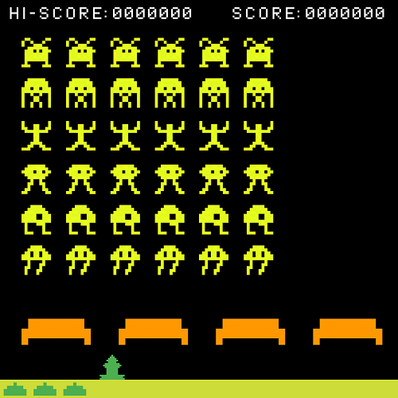

# SpaceInvaders-ARM_Mbed

Klasična igra space invaders na Mbed platformi.

# Opis projekta

Cilj našeg projekta jeste da kreiramo klasičnu igricu *"Space Invaders"* na Mbed platformi i operativnom sistemu. "Space Invaders" je jednostavna dvodimenzionalna igrica. Vi kontrolišete svoje laserske baze protiv beskrajnih vanzemaljskih osvajača. Kada raščistite jedan val neprijatelja, drugi vas ponovo čeka. Iako *"Space Invaders"* izgleda jednostavno po današnjim kriterijima, ova je igra bila veoma utjecajna u razvitku industrije videoigara i igraćih konzola. Projekat će biti kodiran u *C* jeziku, dok ćemo čitav sistem simulirati putem Mbed simulatora.

Zbog ograničenja simulatora, čitav kod mora biti u jednom fajlu kako bi se pokrenuo.

# Snimak igrice

# MoSCoW Prioritizacija

## Mora imati

+ Kontrole

  Naša videoigra će biti kontrolisana putem četiri tastera: dva tastera za kretanje igrača desno i lijevo, taster za pucanje i taster za zaustavljanje igrice.

+ Igraća ploča

  Igraća ploča se sastoji od četiri zgrade na dnu koje štite igrača, lasersku bazu igrača putem koje uništava vanzemaljce i niz vanzemaljskih svemirskih letjelica u formaciji izgleda matrice veličine 6x6. Primjer izgleda igrice:

  

+ Bodovanje

  Bodovanje je veoma jednostavno, na slici 1.1 je prikazano 5 vrsta vanzemaljaca od dna do vrha. Njihovo uništavanje nosi 10, 10, 20, 20, 30 i 30 bodova, respektivno. Bodovi se prikazuju u gornjem dijelu ekrana zajedno sa najboljim ostvarenim rezultatom.

+ Pravila igre

  + Kad jednom napadači dođu do desne ili lijeve ivice ekrana, spustit će se za jedan red i krenuti u suprotnom smjeru,
  + Kada napadači stignu do reda u kojem je laserska baza igrica je izgubljena, kao i kada igrač izgubi sve svoje laserske baze,
  + Napadači nasumično ispaljuju projektile koji se spuštaju prema dnu ekrana. Oni mogu uništiti igrača ili uništiti/oštetiti zgrade,
  + Igrač može imati samo jedan projektil ispaljen istovremeno,
  + Svakih 1500 osvojenih bodova, igrač dobija novu lasersku bazu (maksimalno može imati tri).

+ Highscore

  Igrica treba imati prikaz najboljeg ostvarenog rezultata u igrici.

## Treba imati

+ Main menu i pauziranje

  Program treba da uključuje "main menu" koji se prikazuje pri pokretanju igrice ili nakon gubitka u istoj. Pritiskom na taster za pauzu igrica se treba pauzirati.

+ Animacije

  Igrica bi trebala imati jednostavne animacije, pri svakom pokretu vanzemaljaca, njihov se oblik mijenja kako bi simulirali kretanje, te projektili vanzemaljaca i laserske baze mijenjaju oblik tokom leta.

+ Ubrzavanje vanzemaljaca

  Što je više vanzemaljaca uništeno, to će se brže kretati. Njihova brzina će se mijenjati kada stignu do ivice ekrana.

## Može imati

+ Dodatni bodovi
  
  Ako se posljednji uništeni vanzemaljci nalaze u donja dva reda, bit će prikazan vatromet i igrač dobija 500 dodatnih bodova. Ako je posljednji uništeni vanzemaljac onaj koji se nalazio u donjem-lijevom uglu formacije, igrač dobija vatromet i bonus od 1000 bodova.

+ Postepeno uništavanje zgrada

  Prvobitna igrica *"Space Invaders"* koristila je bit-mask za dodavanje štete zgradama na bazi pojedinačnih piksela. Neku vrstu postepene štete zgradama bi bilo lijepo, ali ne neophodno implementirati.

+ Otežavanje novih valova

  Moguće je implementirati da se svaki novi val kreće sve većom brzinom, međutim, posljedice toga neće biti jasne dok se eksperimentalno ne provjeri.

## Neće imati

+ Multiplayer

  Zbog veoma malog prostora za igranje i dosta malog ekrana, nećemo uključivati bilo koju vrstu podrške za više igrača.